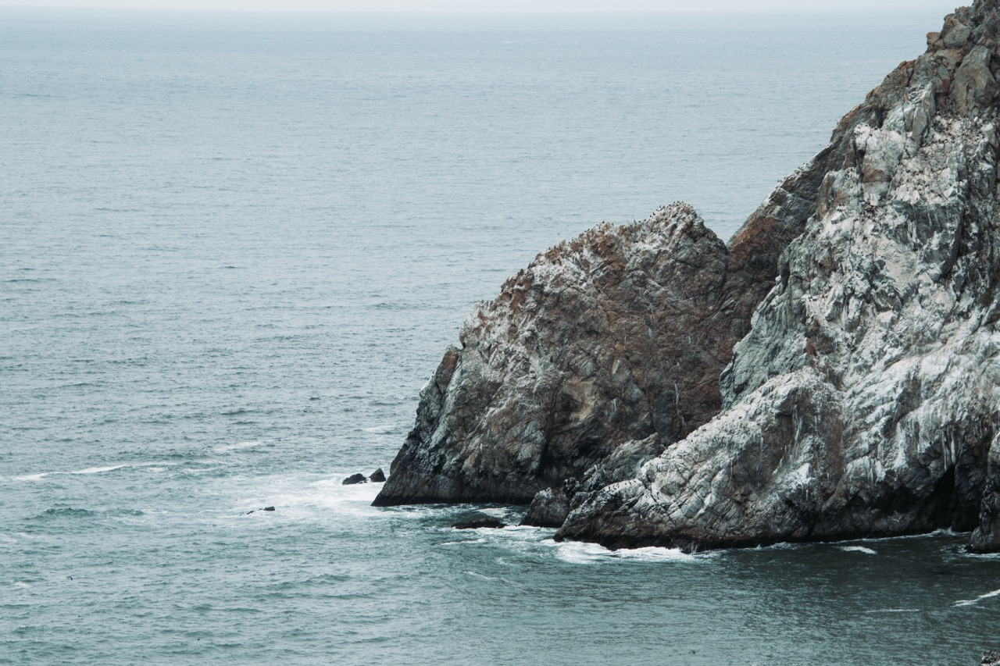
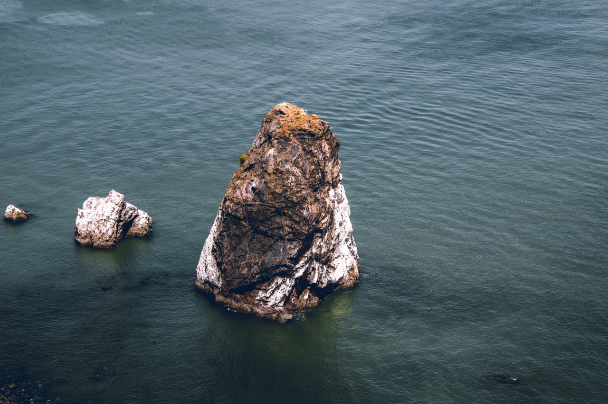

I'm not a professional photographer, but I still like to take pictures of the interesting things that happen around me and that I see.

  
   
   
   
   
   
   
   
   
   
   
   
   
   
   
   
   
   
  

{:.figcaption}

If you are interested in the photos I took, you can find more of my work on my instagram
I post pictures from my adventures and occasionally of portraits I take for my friends.
